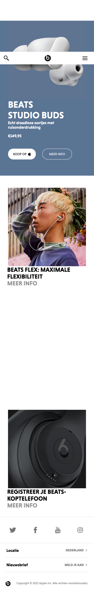

# Procesverslag

## Jij

### Auteur:
Daan Honing

#### Je startniveau:
Blauw

#### Je focus:
Responsive
 
 
## Je website

Details

### Je opdracht:
https://www.beatsbydre.com/nl

#### Screenshot(s) van de eerste pagina (small screen): 
Home pagina, Beats by Dr Dre

#### Screenshot(s) van de tweede pagina (small screen):
Koop pagina, Beats by Dr Dre  

 

## Breakdownschets (week 1)

uitwerken na afloop 2e werkgroep

### de hele pagina: 

### dynamisch deel (bijv menu): 

### wellicht nog een dynamisch deel (bijv filter): 

## Voortgang 1 (week 2)

uitwerken voor 1e voortgang

### Stand van zaken
Het werken met de EM als grootte had ik eigenlijk nog nooit gedaan, maar is enorm handig. Ook vind ik het erg fijn dat we zijn begonnen met de mobiele versie aangezien dit een stuk makkelijker is. 

Ik werk mijn code van boven naar beneden toe, zowel html als css, zodat ik altijd weet waar ik mee bezig ben. Op dit moment loopt mijn code best soepel en ben ik erg trots op het positioneren van dingen, aangezien ik hier voorheen altijd moeite mee had.

Alhoewel ik wel enigszins achterloop met de breakdownschetsen heb ik een aardig goed beeld van wat mij te wachten staat. Ik loop hiermee achter vanwege het werk van vormgeving.

### Agenda voor meeting
samen met je groepje opstellen

### student 1 Rebecca 
 - Hoe ik het beste een logo in de Header zet 
 - Hoe ik de P en H1 in een section kan aanpassen
 - Waarom de pagina niet verder wil scrollen

### student 2 Beyza          
 -

### student 3 Isabelle                                       
 - Hoe ik het beste een img over een img kan zetten
 - Hoe ik het beste een indeling kan maken voor mijn verschillende buttons

### student 4 Ik
 - Hoe de animatie infade op mijn site zet
 - Hoe ik mijn midden beter kan fixen
 - Hoe ik ervoor kan zorgen dat de knoppen niet wrappen

### Verslag van meeting

De meeting met Robert ging er goed. We hebben eerst gekeken naar de oefeningen en daarna naar de vragen van elke student. Zo heeft Robert ons bepaalde dingen via codepen laten zien die enorm kunnen helpen. Bij mij heeft ie laten zien hoe ik de knoppen kan fixen met behulp van nowrap en hoe ik het midden kan fixen met een span.

## Voortgang 2 (week 3)

uitwerken voor 2e voortgang

### Stand van zaken
Na het 1e feedback moment ben ik eigenlijk een stuk verder gekomen dan eerst. We kwamen er tijdens mijn eerste feedback moment achter dat mijn css nogal een experimenteer document bevatte die erg veel elementen had die veel makkelijker opgelost kunnen worden. Ik heb alles uitgesorteerd, nette notities bijgevoegd zodat dit enorm overzichtelijk is. 

Hieronder een een screenshot van m'n site:
### Hieronder een een screenshot van m'n site:: 

### Agenda voor meeting
samen met je groepje opstellen

| student 1      | student 2          | student 3    | student 4        |
| ---            | ---                | ---          | ---              |
| dit bespreken  | en dit             | en ik dit    | en dan ik dat    |
| en dat ook nog | dit als er tijd is | nog een punt | dit wil ik zeker |
| ...            | ...                | ...          | ...              |

### Verslag van meeting
hier na afloop snel de uitkomsten van de meeting vastleggen

- punt 1
- punt 2
- nog een punt
- ...

## Toegankelijkheidstest (week 4)

uitwerken na test in 8e voortgang

### Bevindingen
Lijst met je bevindingen die in de test naar voren kwamen:

#### Titel eerste bevinding
Hier korte omschrijving (met indien nodig een afbeelding)

Hier een omschrijving van hoe het opgelost kan worden (met indien nodig een afbeelding)

#### Titel tweede bevinding. 
Hier korte omschrijving (met indien nodig een afbeelding)

Hier een omschrijving van hoe het opgelost kan worden (met indien nodig een afbeelding)

#### Titel volgende bevinding. 
Hier korte omschrijving (met indien nodig een afbeelding)

Hier een omschrijving van hoe het opgelost kan worden (met indien nodig een afbeelding)

#### Titel nog een bevinding. 
Hier korte omschrijving (met indien nodig een afbeelding)

Hier een omschrijving van hoe het opgelost kan worden (met indien nodig een afbeelding)

## Voortgang 3 (week 4)

uitwerken voor 3e voortgang

### Stand van zaken
hier dit ging goed & dit was lastig (neem ook screenshots op van delen van je website en code)

### Agenda voor meeting
samen met je groepje opstellen

| student 1      | student 2          | student 3    | student 4        |
| ---            | ---                | ---          | ---              |
| dit bespreken  | en dit             | en ik dit    | en dan ik dat    |
| en dat ook nog | dit als er tijd is | nog een punt | dit wil ik zeker |
| ...            | ...                | ...          | ...              |

### Verslag van meeting
hier na afloop snel de uitkomsten van de meeting vastleggen

- punt 1
- punt 2
- nog een punt
- ...

## Eindgesprek (week 5)

uitwerken voor eindgesprek

### Stand van zaken
hier dit ging goed & dit was lastig (neem ook screenshots op van delen van je website en code)

### Screenshot(s)

hier screenshot(s) van je eindresultaat

## Bronnenlijst

continu bijhouden terwijl je werkt

Nb. Wees specifiek ('css-tricks' als bron is bijv. niet specifiek genoeg).

1. bron 1
2. bron 2
3. ...

